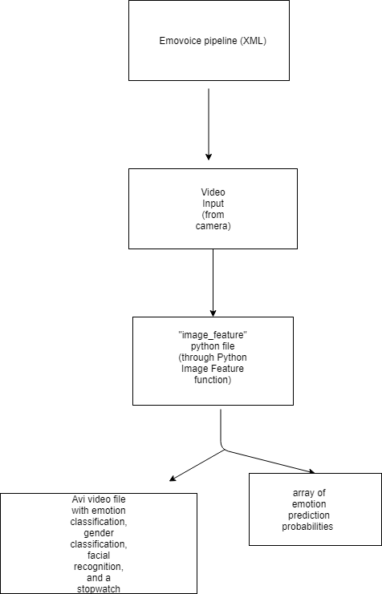

# Project_Face_Emotion
Wish Wang

## Purpose of project
* The purpose of this project is to identify emotions by using a camera and to improve on emotion classification. The application works by detecting the face at first. After detecting the face, it would identify which emotion it is, and its gender based on the features of one's face. 

## Flow chart of the program

## Detail
### XML Pipeline
* Used computer camera to initialize 
- Used the Openface model and will use AU regression values in the future
### Python Image Feature
