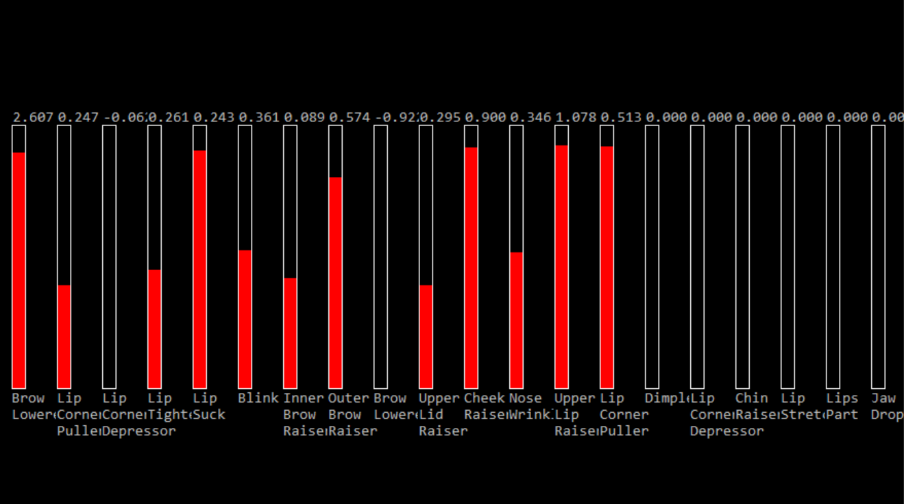
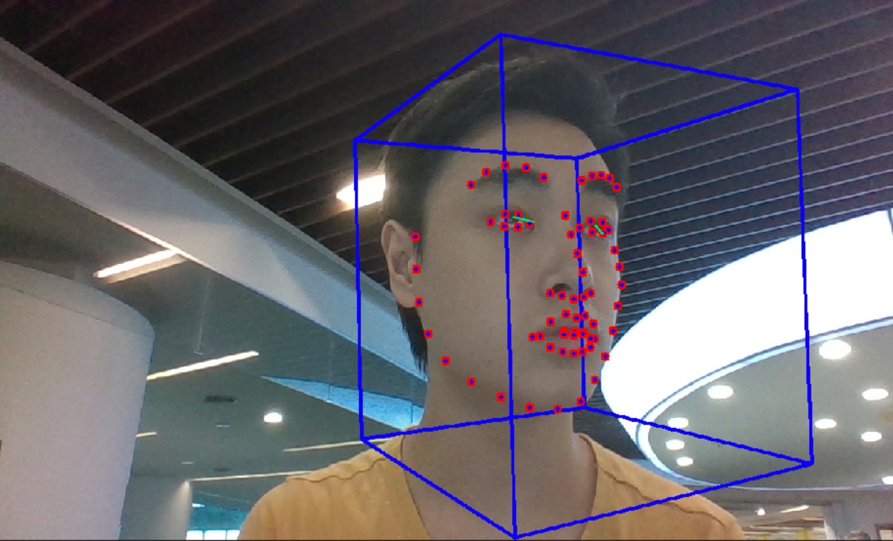
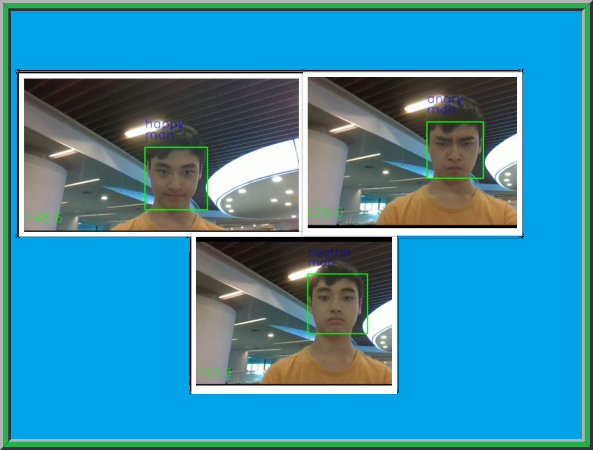

# Project_Face_Emotion
Wish Wang

## Purpose of project
* The purpose of this project is to identify emotions by using a camera and to improve on emotion classification. The application works by detecting the face at first. After detecting the face, it would identify which emotion it is, and its gender based on the features of one's face. 

## Flow chart of the program

## Detail
### XML Pipeline
* Used computer camera to initialize 
- Used the Openface model and will use AU regression values in the future
* Created PythonImageFeature
     * Cloned XML pipeline to python file by using video from camera as the input
     - Output an array of emotion classification probabilities

### Python Image Feature (image_feature.py)
* Based on a Xception CNN model already trained (link: https://github.com/oarriaga/face_classification)
- Included emotions: angry, disgust, fear, happy, sad, surprise, and neutral
* Recorded the time to classify face, emotion, and gender whilst in first run
- Recorded the video from camera using cv2 module
    * Avi format
    - Include face identification (using rectangle to show full face), emotion classification and gender classification (by using text on top of face)
    * Include stopwatch to make sure there will not be losing frames in video

### Improvement of emotion classification
* Used an algorithm that combines 2D numpy array classification from older frame and 2D numpy array classification from new frame
    * Used 24% of old frame value and 76% of new frame value to get final classification value for emotion
    - New frame will be stored in memory and another frame would be captured from the camera
    * Ensure emotion classification would not be changing at a fast rate

### Connect to openface
* Use final 2D numpy array as output from python file
